# JDE Order Hold Workflow

The JDE Order Hold workflow is an end‑to‑end automated solution designed to streamline the identification, enrichment, review, and resolution of order holds.
When an order is placed on hold in JDE, a system‑generated email is automatically sent and triggers a Power Automate flow. This flow extracts the relevant order details and creates a new record in the SharePoint Order Hold list, which serves as the system of record.
Once created, the SharePoint record is enriched through two parallel automated processes.
The Quote Evaluation flow leverages an Office Script lookup to retrieve customer and sales contact information, while the Contract Pricing Lookup flow uses a DAX query to pull applicable price codes and historical sales data. Both processes update the same SharePoint record to ensure a complete and consistent view of the order.
After enrichment, the order becomes visible in the JDE Order Hold Power App, where the Contract Activation team reviews the details and determines the appropriate next action.
Orders can be approved and completed directly within the app or routed to Strategic Sales when additional approval is required.
For Strategic Sales reviews, an automated approval flow sends an email to the assigned contact, allowing approval or rejection directly from the email. The final decision is written back to SharePoint and immediately reflected in the Power App, ensuring transparency, traceability, and timely resolution.

```mermaid
flowchart TD
    %% Node definitions
    START([JDE Order Hold Email])
    PARSE[Power Automate Flow<br/>Parse Email Content]
    SP([New Order Hold Record<br/>SharePoint])
    FINAL([Enriched Order Hold Record<br/>SharePoint])

    START -->|Trigger| PARSE
    PARSE -->|Create new item| SP

    %% Enrichment
    subgraph Enrichment[Automated Enrichment]
        direction LR

        %% Quote Evaluation Flow
        subgraph QE_FLOW["Quote Evaluation Flow"]
            direction TB
            QE[Quote Eval Automated]
            QE_INPUT[/Capture key order details<br/>ID, ShipTo, Order#, etc./]
            QE_SCRIPT[Run Office Script]
            QE_RETRIEVE[/Retrieve customer and sales team details/]
            QE_UPDATE[Update record with contact details]

            QE --> QE_INPUT --> QE_SCRIPT --> QE_RETRIEVE --> QE_UPDATE
        end

        %% Contract Pricing Lookup Flow
        subgraph CPL_FLOW["Contract Pricing Lookup Flow"]
            direction TB
            CPL[Contract Pricing Lookup Automated]
            CPL_INPUT[/Capture key order and customer details<br/>ID, ShipTo, SoldTo, etc./]
            CPL_DAX[Run DAX Query]
            CPL_RETRIEVE[/Retrieve pricing code and sales history/]
            CPL_UPDATE[Update record with pricing info]

            CPL --> CPL_INPUT --> CPL_DAX --> CPL_RETRIEVE --> CPL_UPDATE
        end
    end

    %% Trigger enrichment flows
    SP --> QE
    SP --> CPL

    %% Write back to enriched record
    QE_UPDATE --> FINAL
    CPL_UPDATE --> FINAL

    %% Review and approval process via Power App
    APP[JDE Order Hold Power App<br/>Review and Manage Holds]
    REVIEW[Contract Activation Team<br/>Review Order]
    DECISION{Approval needed<br/>from Strategic Sales?}
    DIRECT_APPROVE[Approve in app and release order in JDE]
    ASSIGN[Assign to Strategic Sales]
    EMAIL_FLOW[Power Automate Flow<br/>Send Approval Email]
    EMAIL_APPROVE[Strategic Sales approves<br/>via email]
    UPDATE_STATUS[Update SharePoint record<br/>and refresh Power App]
    CLOSED([Order Completed])

    FINAL --> APP --> REVIEW --> DECISION
    DECISION -->|No| DIRECT_APPROVE --> UPDATE_STATUS --> CLOSED
    DECISION -->|Yes| ASSIGN --> EMAIL_FLOW --> EMAIL_APPROVE --> UPDATE_STATUS

    %% Style definitions
    classDef startEnd fill:#FFB500,stroke:#000,stroke-width:2px,color:#000
    classDef process fill:#FFFFFF,stroke:#000,stroke-width:1px,color:#000
    classDef data fill:#FFFFFF,stroke:#0078D4,stroke-width:2px,color:#000
    classDef subprocess fill:#F2F2F2,stroke:#000,stroke-width:1px,color:#000
    classDef io fill:#F8F8F8,stroke:#000,stroke-width:1px,color:#000,font-style:italic
    classDef decision fill:#FDE7E9,stroke:#A4262C,stroke-width:2px,color:#000
    classDef appStep fill:#E3F7E0,stroke:#107C10,stroke-width:2px,color:#000
    classDef approval fill:#FFF4CE,stroke:#8A5A0A,stroke-width:2px,color:#000
    classDef terminate fill:#EAF4FF,stroke:#005A9E,stroke-width:2px,color:#000

    class START,CLOSED startEnd
    class PARSE,QE,CPL,EMAIL_FLOW process
    class SP,FINAL data
    class QE_SCRIPT,CPL_DAX subprocess
    class QE_INPUT,QE_RETRIEVE,CPL_INPUT,CPL_RETRIEVE io
    class DECISION decision
    class APP,REVIEW,DIRECT_APPROVE,ASSIGN appStep
    class EMAIL_APPROVE approval
    class UPDATE_STATUS terminate

    linkStyle default stroke:#666,stroke-width:1.8px
```

